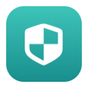
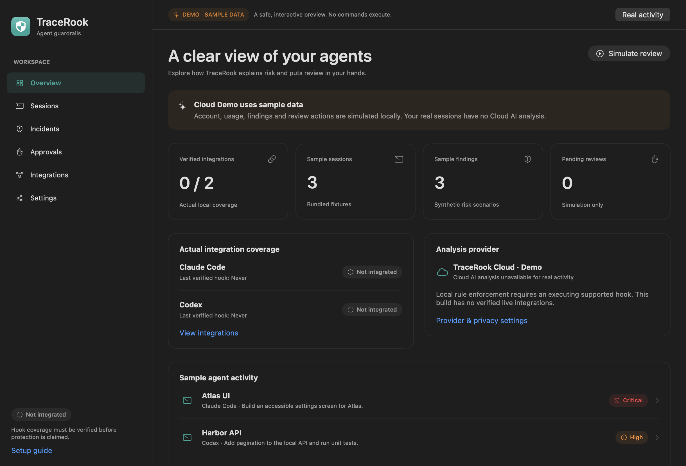

<p align="center">
  
</p>

<h1 align="center">TraceRook</h1>

<p align="center">
  <strong>Let your agent build. Keep the next move in check.</strong>
</p>

<p align="center">
  Native macOS guardrails for coding agents.<br>
  Local rules first. Contextual analysis with Anthropic Claude.
</p>

<p align="center">
  <strong>macOS 26+</strong> &nbsp;·&nbsp; Apple Silicon &nbsp;·&nbsp; Swift 6 + SwiftUI &nbsp;·&nbsp; MIT
</p>

<p align="center">
  <a href="https://tracerook.dev">Website</a> &nbsp;·&nbsp;
  <a href="https://tracerook.dev/pricing/">Pricing</a> &nbsp;·&nbsp;
  <a href="https://tracerook.dev/docs/">Documentation</a> &nbsp;·&nbsp;
  <a href="https://github.com/kleprevost/tracerook/releases/tag/v0.1.0-beta.1">Download the beta</a>
</p>

TraceRook reviews what your coding agent is about to do before it does it. It runs inside **Claude Code**'s `PreToolUse` hook, checks every proposed tool call against deterministic local rules, and sends ambiguous actions to **TraceRook Cloud**, where **Anthropic Claude** judges whether the action fits the task you asked for. Critical actions are blocked on the spot, high-risk actions wait for your decision, and every outcome comes with the evidence behind it.



## Why TraceRook

- **Review before execution.** Dangerous tool calls are denied before the tool body runs. High-risk calls pause for a native review with a 45-second deadline.
- **Local policy + Claude context.** Deterministic rules catch credential exfiltration, destructive commands and remote execution on your Mac in milliseconds. TraceRook Cloud adds task-relevance, prompt-injection and intent-drift analysis with Claude Haiku 5.5.
- **Private by design.** Claude receives coarse task and action categories plus enumerated local signal codes. Raw commands, paths, code, file contents and transcripts never leave your Mac.
- **Exact-action approvals.** **Allow once** releases one specific pending invocation, bound to its fingerprint and nonce. Replays, stale notifications and late clicks are rejected.
- **Native from top to bottom.** A menu bar companion, session timelines, incident details and actionable notifications, built in SwiftUI.

## Beta

TraceRook is in an **invitation-only private beta** for Apple Silicon Macs running macOS 26 or later. Invited members receive the download and a TraceRook Cloud access code. Billing isn't active during the beta; the planned price is **$20/month**, including TraceRook Cloud analysis. [Request an invitation](https://tracerook.dev/register/), then follow the [installation guide](docs/BETA_RELEASE.md).

| Agent | Status |
| --- | --- |
| Claude Code | Supported — pre-execution blocking, Cloud analysis and native review |
| OpenAI Codex | Coming soon |

## About

TraceRook is built by its co-founders:

- **Kyle LePrevost** — [kyle@tracerook.dev](mailto:kyle@tracerook.dev) · [hardcidr.com](https://hardcidr.com)
- **John Yang** — [john@tracerook.dev](mailto:john@tracerook.dev) · [LinkedIn](https://www.linkedin.com/in/johnwyang/)

## Repository layout

| Path | Contents |
| --- | --- |
| `App/` | SwiftUI app, menu bar companion and review window |
| `Agent/` | Per-user background service |
| `HookCLI/` | `tracerook-hook`, the bridge invoked by agent hooks |
| `Packages/` | Shared Swift modules: contracts, adapters, privacy, rules, core, fixtures |
| `Tests/` | Swift Testing suites |
| `cloud/` | TraceRook Cloud — Cloudflare Worker serving `api.tracerook.dev` |
| `backend/` | Python local API for development and demos |
| `website/` | Static site and documentation for tracerook.dev |

## Build from source

```sh
./scripts/build.sh
open build/TraceRook.app
```

`open build/TraceRook.app --args --demo` launches with bundled sample sessions. See the [development guide](docs/DEVELOPMENT.md) for Xcode, tests, the Cloud Worker and the website.

## Documentation

| Guide | Contents |
| --- | --- |
| [Product documentation](https://tracerook.dev/docs/) | Setup, policy, approvals, Claude analysis, privacy and integrations |
| [Installation](docs/BETA_RELEASE.md) | Download, open, connect TraceRook Cloud and configure Claude Code |
| [Development](docs/DEVELOPMENT.md) | Build, run and test every component |
| [Architecture](docs/ARCHITECTURE.md) | Processes, modules and transports |
| [Privacy](docs/PRIVACY.md) | What stays on your Mac, what reaches Claude and what is retained |
| [Threat model](docs/THREAT_MODEL.md) | Trust boundaries and how each is enforced |
| [Agent compatibility](docs/AGENT_COMPATIBILITY.md) | Hook formats and decision output |
| [Cloud API](cloud/CONTRACT.md) | The `/v1` protocol served by TraceRook Cloud |
| [Security](SECURITY.md) | Security model and vulnerability reporting |

## License

[MIT](LICENSE) · Copyright © 2026 Kyle LePrevost.

Claude is a product of Anthropic. TraceRook is an independent project; no affiliation or endorsement is implied.
